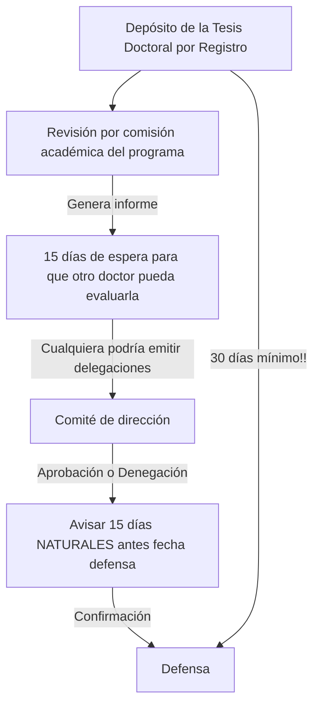

# Depósito de la tesis
Estas instrucciones aplican para tesis por compendio de artículos con mención internacional. Instrucciones elaboradas a curso académico 2022-2023. Las instrucciones es posible que estén desactualizadas, validar siempre contra la normativa actual.

## Checklist
- [ ] Adjuntar tesis Doctoral
- [ ] Adjuntar artículos para compendio
  - [ ] Artículo 1
  - [ ] Artículo 2
  - [ ] Artículo 3
- [ ] Formulario de depósito de tesis
- [ ] Formulario del informe del director de tesis para la autorización de la defensa de la tesis doctoral
  - [ ] Director
  - [ ] Codirector (si procede)
- [ ] Formulario de propuesta de miembros del tribunal de tesis doctoral
- [ ] Documento para la evaluación de méritos de investigación
  - [ ] Miembro externo 1 (si procede)
  - [ ] Curriculum vitae del miembro externo 1 (si procede)
  - [ ] Miembro externo 2 (si procede)
  - [ ] Curriculum vitae del miembro externo 2 (si procede)

- [ ] Formulario de ética de la investigación
- [ ] Formulario de autorización de coautores en contribución
	- [ ] 	Artículo 1: Titulo articulo
		- [ ] 		Autor 1
		- [ ] 		Autor 2
		- [ ] 		Autor N
	- [ ] 	Artículo 2: Titulo articulo
		- [ ] 		Autor 1
		- [ ] 		Autor 2
		- [ ] 		Autor N
	- [ ] 	Artículo 3: Titulo articulo
		- [ ] 		Autor 1
		- [ ] 		Autor 2
		- [ ] 		Autor N	

- [ ] Declaración responsable de informar a colaboradores
- [ ] Documentación para solicitar la Mención Internacional
	- [ ] Formulario de solicitud de la mención internacional del título de doctor
	- [ ] Autorización CA (Justificante de notificación por registro en su defecto)
	- [ ] Certificado de realización de la estancia. 
- [ ] Formulario de informe de experto de centro extranjero para mención internacional 
	- [ ] Experto 1: Nombre Apellidos
	- [ ] Experto 2: Nombre Apellidos

## Esquema temporal

IMPORTANTE: Las fechas de las reuniones de las comisiones academicas y el comite de direccion son aprox mensuales y deberian ser publicas.

## Resumen normativa aplicable
**¡¡Siempre revisa por si acaso!!**

### Artículo 23. Depósito de la tesis

1. El doctorando que desee depositar la tesis doctoral para su lectura y defensa, previo informe favorable del director/es de la Tesis, presentará dos ejemplares de la tesis doctoral y dos CD's con la tesis en formato PDF a la Comisión Académica del programa a través del Registro General o Registros Auxiliares de la Universidad Rey Juan Carlos. 
2. La tesis estará impresa a doble cara, en formato A4 o B5, y tendrá una encuadernación en pasta blanda o dura, no manipulable (con las páginas encoladas o cosidas). Los dos ejemplares reflejarán los datos grabados o impresos de la tesis en la portada y en el lomo, según el modelo aprobado y publicado en la web de la Escuela Internacional de Doctorado. La cubierta presentará la misma información que la portada. 
3. Para garantizar, con anterioridad a su presentación formal, la calidad del trabajo desarrollado, se aportará al menos una publicación aceptada o publicada en un medio de impacto en el ámbito de conocimiento de la tesis doctoral firmada por el doctorando, que incluya parte de los resultados de la tesis. La Comisión Académica del programa de doctorado, teniendo en cuenta los criterios vigentes utilizados por la CNEAI para valorar las contribuciones científicas en el proceso de evaluación de los períodos de actividad investigadora, será la responsable de valorar la adecuación e idoneidad de dicha publicación. Ésta deberá haber sido publicada o aceptada con posterioridad a la fecha de inicio de los estudios de doctorado, no podrá haber sido empleada anteriormente con el mismo fin y deberá constar la Universidad Rey Juan Carlos en la filiación del doctorando o director. Será preciso entregar en el depósito de la tesis una copia completa de la publicación o publicaciones donde conste necesariamente: el nombre y adscripción del autor y de todos los coautores, en su caso, así como la referencia completa de la revista o editorial en la que los trabajos hayan sido publicados o aceptados para su publicación, en cuyo caso se aportará justificante de la aceptación por parte del editor jefe de la revista o editorial. Igualmente se aportará una carta firmada por cada uno de los coautores autorizando a que dicha publicación sea utilizada en el ámbito de la tesis.
	
	
### Artículo 24. Autorización y publicidad de lectura de la tesis 

1. **Autorizada la presentación de la tesis por la Comisión Académica, se concederán 15 días naturales, con el fin de que cualquier doctor pueda examinarla y en su caso formular por escrito cuantas alegaciones estime oportuna.** 
2. La Comisión Académica responsable del programa de doctorado remitirá la tesis doctoral, junto con toda la documentación que el proceso de evaluación de la tesis haya generado, al Comité de Dirección, **adjuntando la propuesta de expertos en la materia** que puedan formar parte del tribunal encargada de juzgarla. 
3. Al objeto de que la Universidad pueda garantizar, con anterioridad a su presentación formal, la calidad de las tesis doctorales, el Comité de Dirección podrá someter a evaluación externa las tesis doctorales que considere, mediante su envío a dos expertos doctores ajenos a la Universidad Rey Juan Carlos del área o áreas de conocimiento relacionadas con el programa de doctorado en el que se ha inscrito la tesis de entre los externos de las bases de datos de la ANECA. 
4. A los efectos previstos en el apartado anterior, en el caso de ser necesaria la evaluación externa, la Comisión Académica del programa de doctorado enviará al Comité de Dirección una lista compuesta por un máximo de 20 especialistas. En dicha lista figurarán los datos personales, profesionales y un breve currículum vitae de cada uno de los especialistas propuestos. El Comité de Dirección elegirá a dos evaluadores de la lista. 
5. Los dos evaluadores externos deberán remitir un informe motivado sobre la tesis doctoral en el plazo máximo de un mes. 
6. **Transcurrido el plazo de depósito, y a la vista de los informes de los evaluadores, el Comité de Dirección decidirá si se admite o no a trámite**. En los supuestos de no autorización de la defensa de la tesis, el Comité de Dirección deberá comunicar por escrito al doctorando, al director de la tesis y a la Comisión Académica del programa de doctorado las razones de su decisión. 
	
### Artículo 25. Nombramiento del tribunal de tesis 
Autorizada la defensa de la tesis doctoral, y a propuesta de la Comisión Académica del programa de doctorado, el Comité de Dirección nombrará el tribunal de tesis. 

### Artículo 26. Composición del tribunal
1.  El tribunal de tesis será propuesto por la Comisión Académica del programa de doctorado. Sus miembros serán doctores especialistas en la materia a que se refiere la tesis o en otra que guarde afinidad con la misma y contarán con experiencia investigadora acreditada. Los miembros que sean profesores permanentes **deberán poseer al menos un sexenio de investigación**. Los profesores o investigadores con cargos en los que no sean de aplicación los criterios de CNEAI deberán aportar méritos de investigación equivalentes que serán evaluados por el Comité de Dirección a propuesta de la Comisión Académica de cada programa. En todo caso, el tribunal estará formado por una **mayoría de miembros externos a la Universidad** y las instituciones colaboradoras en la Escuela o programa. 
2. El tribunal estará compuesto por cinco miembros titulares y dos suplentes, salvo que cada programa de doctorado opte, previa justificación, por una composición de sus tribunales que esté formada por tres miembros titulares y tres suplentes y así sea aprobada por el Comité de Dirección de la Escuela Internacional de Doctorado. 
3. De dicho tribunal no podrán formar parte más de dos miembros de la misma Universidad u organismo. En el caso de los Tribunales de tres titulares y tres suplentes, el Presidente o el Secretario y uno de los suplentes deberán pertenecer a la URJC 
4. **Ni el director de la tesis ni el tutor podrán formar parte del tribunal**, salvo casos de tesis presentadas en el marco de acuerdos bilaterales de cotutela con universidades extranjeras que así lo tengan previsto y en virtud de los correspondientes convenios. 
5. El Comité de Dirección designará, entre los miembros del tribunal, a un presidente y un secretario. Éste último preferiblemente pertenecerá a la Universidad Rey Juan Carlos. En caso de renuncia por causa justificada de un miembro titular del tribunal, el presidente procederá a sustituirle por el suplente correspondiente. 

### Artículo 27. Entrega de ejemplares a los miembros del tribunal 
El doctorando remitirá a los miembros del tribunal un ejemplar de la tesis doctoral y una copia del documento de actividades. 

### Artículo 28. Lectura y defensa de la tesis 
1. **El acto de defensa de la tesis se realizará en días hábiles** (excluyendo sábados, domingos, días festivos y períodos vacacionales) dentro del período comprendido entre el **1 de septiembre y el 31 de julio** correspondiente al curso académico, y será comunicado por el secretario a la Escuela Internacional de Doctorado con una **antelación mínima de 15 días naturales** a su celebración. 
2. El acto de defensa tendrá lugar en sesión pública y consistirá en la exposición, por el doctorando de la labor preparatoria realizada, la metodología, así como del contenido y conclusiones de la tesis, haciendo especial mención de sus aportaciones originales al tema objeto de tesis. 
3. El tribunal que evalúe la tesis dispondrá del documento de actividades del doctorando, a que se refiere el artículo 15.1 de esta normativa, con las actividades formativas llevadas a cabo por el doctorando. Este documento de seguimiento no dará lugar a una puntuación cuantitativa pero sí constituirá un instrumento de evaluación cualitativa que complementará la evaluación de la tesis doctoral. 
4. Los miembros del tribunal deberán expresar su opinión sobre la tesis presentada y formularán al doctorando cuantas cuestiones consideren oportunas y el doctorando deberá de igual manera responder, en el momento y forma que señale el presidente del tribunal. Los doctores presentes en el acto público podrán formular cuestiones en el momento y forma que señale el presidente del tribunal. 
5. Finalizada la defensa y discusión de la tesis, cada miembro del tribunal formulará por escrito una valoración sobre ella. 
6. Salvo los supuestos de cotutela de tesis doctorales, la defensa ha de ser efectuada en la Universidad Rey Juan Carlos 
	
### Artículo 29. Calificación de la tesis 
1. Terminada la defensa de la tesis, el tribunal otorgará, previa votación en sesión secreta, la calificación global de **no apto, aprobado, notable o sobresaliente**. 
2. El tribunal podrá proponer que la tesis obtenga la mención de **“cum laude”, si** se emite en tal sentido el voto secreto positivo por **unanimidad**. El escrutinio de los votos se realizará por el personal de administración de la Escuela Internacional de Doctorado en la entrega de las actas correspondientes a la exposición y defensa de la tesis, debiendo estar presente el secretario del tribunal. El resultado se comunicará al doctorando, al director de la tesis, al tutor y al coordinador del programa de doctorado 
3. En todo caso la calificación que proceda se hará constar en el anverso del correspondiente título de doctor. 

### Artículo 30. Mención Internacional en el título de doctor
1.  El título de doctor o doctora podrá incluir en su anverso la mención «Doctorado Internacional», siempre que concurran las siguientes circunstancias: 
	a. Que, durante el periodo de formación necesario para la obtención del título de doctor, el doctorando haya realizado una estancia **mínima de tres meses** fuera de España en una institución de enseñanza superior o centro de investigación de prestigio, cursando estudios o realizando trabajos de investigación. La estancia y las actividades han de ser avaladas por el director y autorizadas por la Comisión Académica, y se incorporarán al documento de actividades del doctorando. 
	b. Que parte de la tesis doctoral, **al menos el resumen y las conclusiones**, se haya redactado y sea presentada en una de las lenguas habituales para la comunicación científica en su campo de conocimiento, distinta a cualquiera de las lenguas oficiales en España. Esta norma no será de aplicación cuando las estancias, informes y expertos procedan de un país de habla hispana.
	c. Que la tesis haya sido informada por un **mínimo de dos expertos doctores** pertenecientes a alguna institución de educación superior o instituto de investigación **no española**. 
	d. Que al menos un experto perteneciente a alguna institución de educación superior o centro de investigación no española, con el título de doctor, distinto del responsable de la estancia mencionada en el apartado a) y de los expertos doctores mencionados en el apartado c), haya formado parte del tribunal evaluador de la tesis. 
2. La defensa de la tesis ha de ser efectuada en la propia universidad española en la que el doctorando estuviera inscrito, o, en el caso de programas de doctorado conjuntos, en cualquiera de las universidades participantes o en los términos que identifiquen los convenios de colaboración. 
3. Cuando se deposite la tesis doctoral la Comisión Académica será informada del propósito de que la tesis cuente con la mención “Doctor Internacional”. **El doctorando habrá aportado la documentación acreditativa de la realización de su estancia y los informes de los dos expertos al Coordinador del programa**, o representante de la Comisión Académica en el caso de los doctorandos interuniversitarios, **siete días naturales antes de la reunión del Comité de Dirección** que vaya a evaluar la autorización de la lectura de la tesis.

## Autores
Sergio Cavero
Raúl Martín
